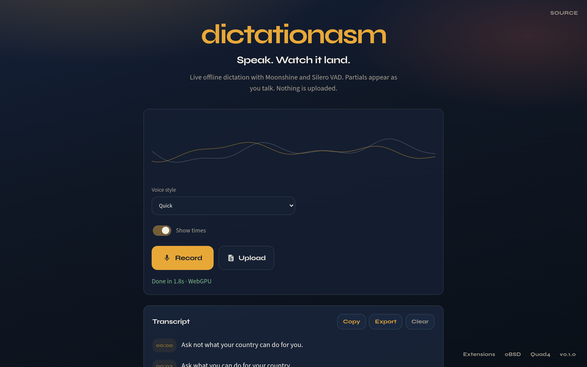

# dictationasm

[](https://github.com/Quad4-Software/dictationasm/actions/workflows/ci.yml) [](https://scorecard.dev/viewer/?uri=github.com/Quad4-Software/dictationasm) [](https://github.com/Quad4-Software/dictationasm/releases) [](https://github.com/Quad4-Software/dictationasm/blob/master/LICENSE) [](https://go.dev/dl/) [](https://dictationasm.quad4.io) [](https://github.com/orgs/Quad4-Software/packages/container/package/dictationasm) [](https://dictationasm.quad4.io)

Offline dictation in the browser. Moonshine ONNX runs on WebGPU with a WASM fallback, Silero VAD decides when an utterance ends, and partial text streams in while you are still talking. Nothing is uploaded.

**Live:** [https://dictationasm.quad4.io](https://dictationasm.quad4.io)



## How it works

- **Models (English):** Moonshine Tiny (`onnx-community/moonshine-tiny-ONNX`) is the default *Quick* style. Moonshine Base (`onnx-community/moonshine-base-ONNX`) is the *Clearer* style.
- **Runtime:** transformers.js on onnxruntime-web. WebGPU when the adapter is available, otherwise the threaded WASM backend. The encoder stays fp32, the merged decoder is q4 on WebGPU and q8 on WASM.
- **Segmentation:** Silero VAD (`onnx-community/silero-vad`) scores 512-sample frames in the same worker as the ASR model. Speech end commits the utterance to the transcript, and each committed line keeps the VAD start and end time so SRT, VTT, and JSON export still work.
- **Partials:** while you keep talking, the current utterance is re-transcribed roughly every 500 ms and shown as a dim ghost line. It is replaced by the committed line on speech end and never lands in an export.
- **Uploads:** a dropped or picked file is segmented with the same detector, then dictated one utterance at a time so text appears progressively.

Model weights and transformers.js are **not** in git. The Docker image downloads them at build time and ships a full offline stack. For a local source build, run `make assets` once.

## Install (Docker)

Clone and build (downloads all models/WASM into the image):

```bash
git clone https://github.com/Quad4-Software/dictationasm.git
cd dictationasm
docker compose up --build
```

Open [http://127.0.0.1:8080](http://127.0.0.1:8080).

Pre-built multi-arch image (`linux/amd64`, `linux/arm64`):

```bash
docker pull ghcr.io/quad4-software/dictationasm:latest
docker run --rm -p 8080:8080 ghcr.io/quad4-software/dictationasm:latest
```

Or with Compose against the published image:

```bash
git clone https://github.com/Quad4-Software/dictationasm.git
cd dictationasm
IMAGE=ghcr.io/quad4-software/dictationasm:latest docker compose up
```

Coolify: use `docker-compose.coolify.yml` and set the domain to container port `8080`.

Bind on all interfaces: `HOST_PORT=0.0.0.0:8080 docker compose up --build`.

## Release binaries

Tagged releases publish static Go servers for Linux, Windows, macOS, FreeBSD, OpenBSD, NetBSD (amd64, arm64, arm, 386, riscv64, and other supported arches).

```bash
# example
curl -LO https://github.com/Quad4-Software/dictationasm/releases/latest/download/dictationasm_X.Y.Z_linux_amd64.tar.gz
tar xzf dictationasm_*.tar.gz
./dictationasm -web /path/to/web -addr :8080
```

The binary serves a `web/` tree. For a full offline tree, clone the repo and run `make assets`, or use the container image (recommended).

## Build from source

Needs Go 1.26+ and Node (for tests).

```bash
git clone https://github.com/Quad4-Software/dictationasm.git
cd dictationasm
make assets
make build
make run
```

```bash
make test
make check
```

Binary: `bin/dictationasm` (default listen `:8080`, web root `web`).

Asset scripts, each safe to re-run:

```bash
bash scripts/fetch-transformers.sh   # transformers.js + onnxruntime-web
bash scripts/fetch-onnx-models.sh    # Moonshine Tiny + Base, calls fetch-vad.sh
bash scripts/fetch-vad.sh            # Silero VAD only
bash scripts/fetch-assets.sh         # display fonts
```

## Screenshots

Capture desktop, mobile, and OG shots into `docs/screenshots/`:

```bash
make screenshots
```

Or point at a running instance:

```bash
SCREENSHOT_BASE_URL=http://127.0.0.1:8080 make screenshots
SCREENSHOT_BASE_URL=https://dictationasm.quad4.io bash scripts/screenshot.sh
```

Reusable tool: `scripts/screenshot/capture.mjs` (Playwright). CI uploads PNGs from the Screenshots workflow.

## License

0BSD
